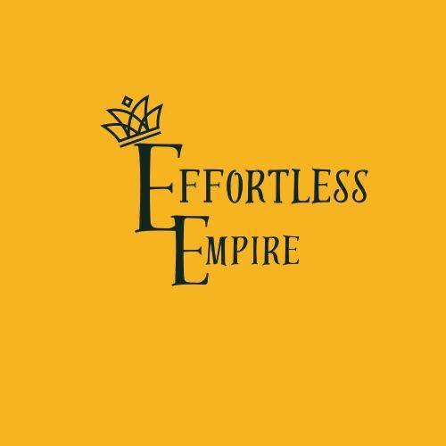

# Effortless Empire Co., Ltd. - Official Website



**Turning Goals Into Reality** - A modern, responsive website for Bangkok's premier academic and career consultancy.

---

## 🌟 About Effortless Empire

Effortless Empire Co., Ltd. is a trusted academic and career consultancy located in Bangkok, Thailand. We specialize in bridging the gap between education and professional success by providing comprehensive guidance and support to help our clients excel in their personal and professional lives.

### Our Mission
To bridge the gap between education and the professional world by offering customized guidance and support to help our customers excel in their personal and professional lives and be peaceful in their minds.

---

## 🚀 Project Overview

This website serves as the digital presence for Effortless Empire Co., Ltd., showcasing our services, success stories, and providing resources for prospective students and professionals seeking academic and career advancement.

### Key Features

- **🎓 Service Showcase**: Detailed information about our three core services
- **🌍 Global Reach**: Support for universities across 6+ countries
- **📚 Resource Center**: Free guides, tools, and educational materials
- **💬 Success Stories**: Real testimonials from satisfied clients
- **📱 Responsive Design**: Optimized for all devices and screen sizes
- **🎨 Professional UI**: Clean, modern design with golden theme

---

## 🛠️ Technology Stack

- **Framework**: [Next.js 15](https://nextjs.org/) with App Router
- **Language**: TypeScript
- **Styling**: [Tailwind CSS](https://tailwindcss.com/)
- **UI Components**: [shadcn/ui](https://ui.shadcn.com/)
- **Images**: Next.js Image Optimization
- **Deployment**: Vercel Platform
- **Version Control**: Git & GitHub

---

## 📋 Services Offered

### 1. 🎓 Education Support
- Education Consultation
- Scholarship Consultancy
- Global University Applications
- Documentation & Proposal Writing
- **Starting from ฿5,000**

### 2. 🗣️ Language Proficiency
- IELTS Training & Mock Tests
- TOEFL & Duolingo Preparation
- English Group & One-on-One Sessions
- Japanese Language Training
- **Starting from ฿3,000**

### 3. 💼 Professional Development
- Job Training Classes
- Career Preparation & Interview Practice
- Intern Opportunities
- Wellbeing & Mental Support
- **Starting from ฿4,000**

---

## 🌍 Supported Countries

We provide university application support for:

| Country | Flag | Universities |
|---------|------|-------------|
| United Kingdom | 🇬🇧 | 150+ Partner Universities |
| Sweden | 🇸🇪 | 50+ Partner Universities |
| Germany | 🇩🇪 | 100+ Partner Universities |
| Canada | 🇨🇦 | 80+ Partner Universities |
| Japan | 🇯🇵 | 60+ Partner Universities |
| Korea | 🇰🇷 | 40+ Partner Universities |

---

## 🚀 Getting Started

### Prerequisites

- Node.js 18.17 or later
- npm, yarn, pnpm, or bun package manager

### Installation

1. **Clone the repository**
   ```bash
   git clone https://github.com/wings11/effortlessempire.git
   cd effortlessempire/frontend
   ```

2. **Install dependencies**
   ```bash
   npm install
   # or
   yarn install
   # or
   pnpm install
   ```

3. **Run the development server**
   ```bash
   npm run dev
   # or
   yarn dev
   # or
   pnpm dev
   ```

4. **Open your browser**
   Navigate to [http://localhost:3000](http://localhost:3000) to view the website.

### Build for Production

```bash
npm run build
npm start
```

---

## 📁 Project Structure

```
frontend/
├── public/                 # Static assets
│   ├── logo.jpg           # Company logo
│   ├── education-support.png
│   ├── language-proficiency.png
│   └── professional-development.png
├── src/
│   ├── app/               # Next.js App Router pages
│   │   ├── about/         # About page
│   │   ├── contact/       # Contact page
│   │   ├── resources/     # Resources page
│   │   ├── services/      # Services page
│   │   ├── testimonials/  # Testimonials page
│   │   ├── layout.tsx     # Root layout
│   │   └── page.tsx       # Home page
│   ├── components/        # Reusable components
│   │   ├── layout/        # Layout components
│   │   │   ├── Footer.tsx
│   │   │   ├── Navbar.tsx
│   │   │   ├── HeroSection.tsx
│   │   │   ├── ServicesGrid.tsx
│   │   │   ├── MissionSection.tsx
│   │   │   └── CountryEducationSection.tsx
│   │   └── ui/            # shadcn/ui components
│   ├── lib/               # Utility functions
│   └── styles/            # Global styles
├── tailwind.config.ts     # Tailwind configuration
├── next.config.mjs        # Next.js configuration
└── package.json           # Dependencies and scripts
```

---

## 🎨 Design System

### Color Palette
- **Primary**: Golden Yellow (`#EAB308`, `#F59E0B`)
- **Secondary**: Amber (`#F7941D`, `#FEF3C7`)
- **Neutral**: Gray scale (`#111827` to `#F9FAFB`)
- **Accent**: Yellow variants for highlights

### Typography
- **Headings**: Bold, responsive scaling from `text-2xl` to `text-6xl`
- **Body**: Clean, readable text with proper line spacing
- **Font**: System fonts optimized for performance

---

## 📊 Performance Features

- ✅ **Next.js Image Optimization**: Automatic image optimization and lazy loading
- ✅ **Responsive Design**: Mobile-first approach with breakpoint optimization
- ✅ **SEO Optimized**: Proper meta tags, semantic HTML, and accessibility
- ✅ **Fast Loading**: Optimized bundle sizes and efficient code splitting
- ✅ **TypeScript**: Type safety and better development experience

---

## 🌐 Pages Overview

| Page | Route | Description |
|------|-------|-------------|
| Home | `/` | Hero section, services overview, mission statement |
| Services | `/services` | Detailed service offerings with pricing |
| About | `/about` | Company story, mission, values, and team |
| Testimonials | `/testimonials` | Client success stories and feedback |
| Resources | `/resources` | Free guides, tools, webinars, and blog articles |
| Contact | `/contact` | Contact form, office info, and FAQ |

---

## 🔧 Development Commands

| Command | Description |
|---------|-------------|
| `npm run dev` | Start development server |
| `npm run build` | Build for production |
| `npm run start` | Start production server |
| `npm run lint` | Run ESLint |
| `npm run type-check` | Run TypeScript checks |

---

## 📱 Responsive Breakpoints

- **Mobile**: `< 640px`
- **Tablet**: `640px - 1024px`
- **Desktop**: `1024px - 1280px`
- **Large Desktop**: `> 1280px`

---

## 🤝 Contributing

We welcome contributions to improve our website! Please follow these steps:

1. Fork the repository
2. Create a feature branch (`git checkout -b feature/amazing-feature`)
3. Commit your changes (`git commit -m 'Add amazing feature'`)
4. Push to the branch (`git push origin feature/amazing-feature`)
5. Open a Pull Request

---

## 📞 Contact Information

**Effortless Empire Co., Ltd.**
- 📍 Bangkok, Thailand
- 📧 info@effortlessempire.co.th
- 📞 +66 (0) 2-XXX-XXXX
- 🌐 [Website](https://effortlessempire.co.th)

---

## 📄 License

This project is proprietary software owned by Effortless Empire Co., Ltd. All rights reserved.

---

## 🙏 Acknowledgments

- **Next.js Team** for the excellent framework
- **Tailwind CSS** for the utility-first CSS framework
- **shadcn/ui** for beautiful, accessible components
- **Vercel** for seamless deployment platform

---

**© 2025 Effortless Empire Co., Ltd. All rights reserved. | Turning Goals Into Reality**
